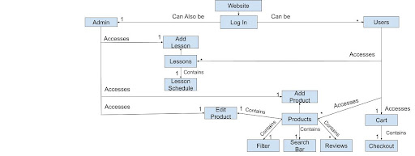

# PROJECT Design Documentation

## Team Information
* Team name: In-Tune
* Team members
  * Hayden Cieniawski
  * Clayton Acheson
  * Jonathan Zhu
  * Donovan Cataldo
  * Damon Gonzalez

## Executive Summary

In-Tune goal is to create a one-stop shop for all music lovers to purchase instruments and learn to use those instruments.

### Purpose
Create an estore to allow users to purchase and learn how to use our instruments. 

### Glossary and Acronyms

| Term | Definition |
|------|------------|
| SPA  | Single Page|
| Product  | An instrument|
| Category  | An instruments musical family (i.e. strings)|
| Instrument  | A specific instrument (i.e. guitar)|
| User  | A person who uses the website|
| Admin  | A person who manages the website|
| Review  | A review of an instrument|
| Cart  | A list of instruments a user wants to purchase|

## Requirements

This section describes the features of the application.

### Functional Requirements

Any user who is not the admin will be able to log in using their username and be presented with a home page where they
can browse products in multiple ways(search bar, top products, by category). They will be able to add any product in
the store to their cart with a requested quantity that is equal to or less than the amount the store has in inventory.
If a user logs out than the products in their cart will be retained. The admin will have the ability to login with the
username 'admin' and be presented with a home page similar to that of a regular user but will include the ability to edit
the inventory of the store. Users who have purchased products will also be able to leave reviews, 
which they can rate on a 1-5 scale and write a short description of their experience with the product. 
These reviews can be seen by all users. Users can also schedule lessons, from which admins can delete and add to.

### Definition of MVP
The MVP will consist of a fully functional estore with a working backend representation of relevant data types.
Any user will be able to login with a username and password or create an account if they have no login. Products
added to their cart will be remembered between sessions and any user should be able to see all products through
a search bar and the products page. The admin will be able to login with the username 'admin' and be able to edit the inventory of the store.
Users who have purchased products will also be able to leave reviews, which they can rate on a 1-5 scale and write a short description of their experience with the product. 
These reviews can be seen by all users. Users can also schedule lessons, from which admins can delete and add to.

### MVP Features
1. Create Account
2. Edit Products
3. Get products by category
4. Browse my cart
5. Save my cart
6. Learn about an Instrument
7. Browse Instrument Categories
8. Log in
9. Search for an Instrument
10. Add an Instrument to my cart
11. Checkout my cart

### Roadmap of Enhancements
1. Add a review - users can add a review to an instrument they have purchased and rate it on a 1-5 scale, alongside a worded description of what they liked or did not like about the instrument.
2. View all reviews - users can view all reviews for an instrument, alongside the average rating and number of reviews written.
3. Look at all Lessons - users can view all lessons that are available to schedule. The lessons will have an instructor, date, time, and instrument.
4. Schedule a Lesson - users can schedule a lesson with an instructor for a specific instrument and date/time from the preselected options.
5. admin privileges for Lesson - admins can add and delete lessons from the schedule. 

## Application Domain

This section describes the application domain.

## Architecture and Design

The application architecture will be separated into 2 distinct components, an angular frontend implementation
and a Spring API backend implementation. 
Frontend:
Backend: The Spring API will implement a Model, View, View_Model structure that will use a local database
in the form of json files, 1 json file for each type of object being handled by the backend.

### Summary

The following Tiers/Layers model shows a high-level view of the webapp's architecture.

The e-store web application, is built using the Model–View–ViewModel (MVVM) architecture pattern. 

The Model stores the application data objects including any functionality to provide persistence. 

The View is the client-side SPA built with Angular utilizing HTML, CSS and TypeScript. 
The ViewModel provides RESTful APIs to the client (View) as well as any logic required to 
manipulate the data objects from the Model.

Both the ViewModel and Model are built using Java and Spring Framework. Details of the components within these tiers are supplied below.

### Overview of User Interface
On landing, the user will be displayed with a selection of the most popular products by name. This will herein be referred to as the dashboard. From here, they will also be able to see, at the header, there will be four options. These include the Dashboard, Products, Login, and Cart. Products will present the user with a list of all current products available along with their photo, name, and price. There is a search bar on this page that allows users to look up products by first name. From here, a user can click on any product to be taken to that products detail page. Here, the user will be able to add the product to their unique cart (if logged in). If they do not have an account/are not logged in, they will be informed that they need to log in. Otherwise, the product can be added to their cart. The login page is a simple page prompting for users to enter their username. A success page will be followed once the user is signed in. Finally, there is a cart page, it is here that users can see what products they have in their cart and how many of each.

### View Tier
The view tier consists of a parent level app component, as well as numerous child components. These are as follows:
1. Dashboard/Home - The dashboard/home page is the first page that a user will see when they visit the site. It will display the most popular products in the store, as well as an introductory animation with the estore logo. Alongside these, there is a mission statement.
2. Products - The products page will display all products in the store. It will display the name, price, and photo of each product. There will be a search bar that allows users to search for products by name. There will also be a button that allows users to filter products by instrument family.
3. Login - The login page will prompt users to enter their username. If the username is not found, the user will be prompted that an account has been made. which then they must login to confirm. If the username is found, the user will be logged in.
4. Cart - The cart page will display all products in the user's cart. It will display the name, price, and photo of each product. There will be a button that allows users to remove products from their cart. There will also be a button that allows users to checkout their cart.
5. Product Detail - The product detail page will display the name, price, and photo of the product. It will also display a description of the product. There will be a button that allows users to add the product to their cart. There will also be a button that allows users to view all reviews for the product. If the User is an Admin, they will be allowed to delete and edit the values of the product
6. Lessons - The lessons page will display all lessons in the store. It will display the name, price, and time of each lesson. There will also be a button that allows users to schedule a lesson. If the user is an admin, they will be allowed to delete and edit the values of the lesson.
7. Checkout - After hitting the checkout button, a component prompting for shipping and billing information will be displayed. After the user enters this information, they will be prompted to confirm their order. If they confirm, the order will be placed and the user will be taken to the confirmation. If they cancel, they will be taken back to the cart page.
8. 404 page - If a user tries to access a page that does not exist, they will be taken to a 404 page. This page will display a message informing the user that the page they are looking for does not exist. It will also display a button that allows the user to return to the home page.
9. Confirmation - After the user confirms their order, they will be taken to a confirmation page. This page will display a message informing the user that their order has been placed. It will also display a button that allows the user to return to the home page. 

### ViewModel Tier
The ViewModel Tier is the Rest-API of our program and it consists only of controllers
for data types used in the View tier. It acts as the point of contact between our front end
and back end. It interacts with HTTP requests and responds with certain bodies and certain error
codes as responses(i.e. OK, CREATED, INTERNAL_SERVER_ERROR, CONFLICT). Our controllers in this tier are responsible for handling the requests and responses. The controllers are responsible for data for users, products, and lessons. 

### Model Tier
The Model Tier has Product, User, Cart classes which represent the data being stored in the
local database. They represent little functionality of the application besides what is needed
to maintain their internal state. The model includes cart, lesson, review, and user. The user, products, and lessons are the only ones that are stored in the database in individual persistance files. The cart is stored in the user object. The lesson and review are stored in the product object. The cart is a list of products that the user has added to their cart. The lesson is a list of lessons that the user can schedule. The review is a list of reviews that users have written for a product. The user is a list of users that have accounts on the site. The user has a cart, while the product have a list of reviews. The lesson is a list of lessons that are available on the site. The DAO classes are only present for products, users, and lessons since these are the only seperated objects that are stored, and many contain object within themselves, but since they are explicitly related to the parent class, they are located within the parents json file, and thus handled by the fileDAO of the parent class.

### Static Code Analysis/Design Improvements

The following are the results of the static code analysis performed on the codebase. The codebase was analyzed using SonarQube. The results of the analysis are as follows:

our backend was particularly strong in terms of its construction, with no major bugs to speak of. There were, however, some code smells with logs in the private field that were unused, and thus taking up space with no actual functionality. Given more time, we would have removed these logs. Although it is not mentioned in the report, it would be nice to change how we handle product classes in the backend, abstracting them would prove to be more efficient in the long run, especially with the additions of lessons into products, as well as equipment and other misc. products sold in relation to instruments.

Our frontend was also strong in terms of its construction, with no major bugs to speak of except a the function login() in the login component. The function had a complexity rating of 40, but due to the time it would have taken to refactor, we decided to ignore it in order to get better functionality out of the site. There were also some code smells with unused imports and unused variables. Given more time, we would have removed these unused imports and variables. Nothing however was of a major concern.

## Testing
Currently 100% of backend tests pass.

### Acceptance Testing
Almost all acceptance tests pass. The only ones that do not pass were in relation to sorting within the lesson component, we decided with the amount of time left for the project with the development with documentation, that we would not be able to fix this issue. The tests that do not pass are as follows:

### Unit Testing and Code Coverage
Our code coverage was at 96 percent. The biggest contributor to our coverage not being 100 percent was missed branches on model and persistance. We were unable to get the coverage to 100 percent due to time constraints. Given more time we would have liked to 100 percent coverage, especially since missed branches in the backend are a major concern. The following is a screenshot of our code coverage:

